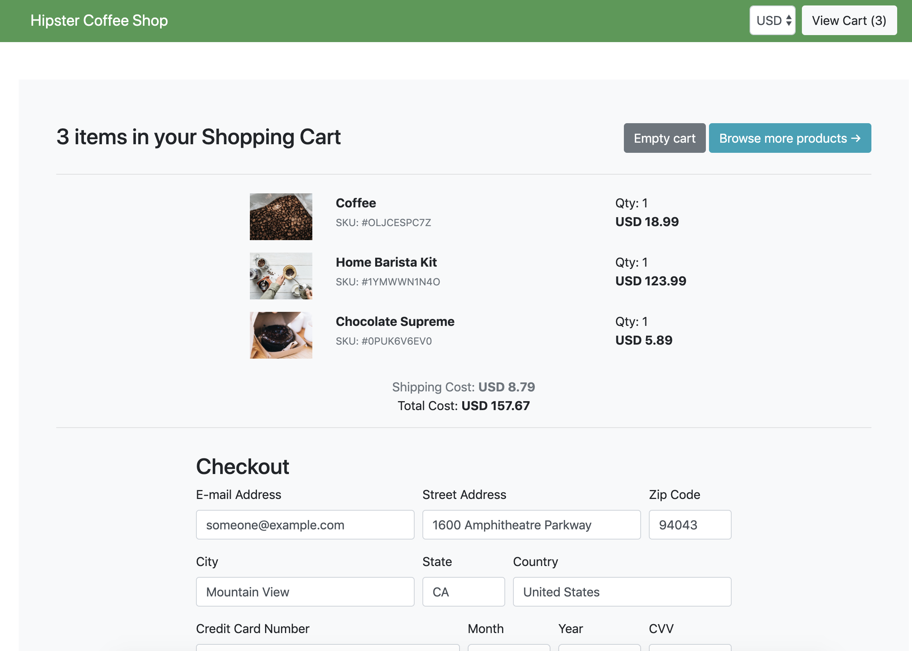

This is a [Lightstep](https://lightstep.com) fork of https://github.com/GoogleCloudPlatform/microservices-demo

# Hipster Shop: Cloud-Native Observability Demo Application

- [Service Architecture](#service-architecture)
- [Features](#features)
- [Installation Options](#installation-options)
- [Prerequisites](#prerequisites)
  - [GKE Installation Only](#gke-installation-only)
  - [Local Installation Only](#local-installation-only)
  - [All Installations](#all-installations)
- [GKE Installation](#gke-installation)
- [Local Installation](#local-installation)
- [(Optional) Deploying on a Istio-installed GKE cluster](#optional-deploying-on-a-istio-installed-gke-cluster)
- [See Telemetry Data in LightStep](#see-telemetry-data-in-lightstep)
- [Cleanup](#cleanup)
- [Conferences featuring Hipster Shop](#conferences-featuring-hipster-shop)


The application is a web-based e-commerce app called **Hipster Shop** where users can browse items,
add them to the cart, and purchase them.  Google uses this application to demonstrate use of technologies like
Kubernetes/GKE, Istio, Stackdriver, gRPC and OpenCensus.

This fork of the repository demonstrate how to instrument for distributed tracing and monitoring using multiple tracing libraries, including OpenTelemetry, OpenTracing, and tracers from LightStep, Zipkin, and Jaeger.
Use the app to learn and experiment with distributed system telemetry and then run [LightStep](https://app.lightstep.com) to see your telemetry data in action.

> 💡 Don't have a LightStep account? Sign up for [**LightStep Developer**](https://go.lightstep.com/signup-dev.html)!

This project contains a 10-tier microservices application, where services are built using different languages and different tracing libraries. It works on any Kubernetes cluster (such as a local one), as well as Google
Kubernetes Engine. It’s **easy to deploy with little to no configuration**.

If you’re using this demo, please **★Star** this repository to show your interest!

 👓**Note to Googlers:** Please fill out the form at [go/microservices-demo](http://go/microservices-demo) if you are using this application.


| Home Page                                                                                                         | Checkout Page                                                                                                    |
| ----------------------------------------------------------------------------------------------------------------- | ------------------------------------------------------------------------------------------------------------------ |
| [](./docs/img/hipster-shop-frontend-1.png) | [](./docs/img/hipster-shop-frontend-2.png) |

## Service Architecture

**Hipster Shop** is composed of many microservices written in different
languages that talk to each other over gRPC.

[](./docs/img/architecture-diagram.png)

Find **Protocol Buffers Descriptions** at the [`./pb` directory](./pb).

| Service                                              | Language      | Description                                                                                                                       |
| ---------------------------------------------------- | ------------- | --------------------------------------------------------------------------------------------------------------------------------- |
| [frontend](./src/frontend)                           | Go            | Exposes an HTTP server to serve the website. Does not require signup/login and generates session IDs for all users automatically. |
| [cartservice](./src/cartservice)                     | C#            | Stores the items in the user's shopping cart in Redis and retrieves it.                                                           |
| [productcatalogservice](./src/productcatalogservice) | Go            | Provides the list of products from a JSON file and ability to search products and get individual products.                        |
| [currencyservice](./src/currencyservice)             | Node.js       | Converts one money amount to another currency. Uses real values fetched from European Central Bank. It's the highest QPS service. |
| [paymentservice](./src/paymentservice)               | Node.js       | Charges the given credit card info (mock) with the given amount and returns a transaction ID.                                     |
| [shippingservice](./src/shippingservice)             | Go            | Gives shipping cost estimates based on the shopping cart. Ships items to the given address (mock)                                 |
| [emailservice](./src/emailservice)                   | Python        | Sends users an order confirmation email (mock).                                                                                   |
| [checkoutservice](./src/checkoutservice)             | Go            | Retrieves user cart, prepares order and orchestrates the payment, shipping and the email notification.                            |
| [recommendationservice](./src/recommendationservice) | Python        | Recommends other products based on what's given in the cart.                                                                      |
| [adservice](./src/adservice)                         | Java          | Provides text ads based on given context words.                                                                                   |
| [loadgenerator](./src/loadgenerator)                 | Python/Locust | Continuously sends requests imitating realistic user shopping flows to the frontend.                                              |

## Features

- **[Kubernetes](https://kubernetes.io)/[GKE](https://cloud.google.com/kubernetes-engine/):**
  The app is designed to run on Kubernetes (both locally on "Docker for
  Desktop", as well as on the cloud with GKE).
- **[gRPC](https://grpc.io):** Microservices use a high volume of gRPC calls to
  communicate to each other.
- **[Istio](https://istio.io):** Application works on Istio service mesh.
- **[OpenCensus](https://opencensus.io/) Tracing:** Most services are
  instrumented using OpenCensus trace interceptors for gRPC/HTTP.
- **[Stackdriver APM](https://cloud.google.com/stackdriver/):** Many services
  are instrumented with **Profiling**, **Tracing** and **Debugging**. In
  addition to these, using Istio enables features like Request/Response
  **Metrics** and **Context Graph** out of the box. When it is running out of
  Google Cloud, this code path remains inactive.
- **[Skaffold](https://skaffold.dev):** Application
  is deployed to Kubernetes with a single command using Skaffold.
- **Synthetic Load Generation:** The application demo comes with a background
  job that creates realistic usage patterns on the website using
  [Locust](https://locust.io/) load generator.

## Installation Options
You can install the Hipster-Shop into these environments:
* [**Google Kubernetes Engine** (GKE)](#gke-installation): Install the app to a similar environment that you'll deploy your production system to.
* [**Locally**](#local-installation): Deploy to a single-node Kubernetes cluster running on your own development machine, using either [Minikube](https://github.com/kubernetes/minikube) (recommended for Linux) or [Docker for Desktop](https://www.docker.com/products/docker-desktop) (recommended for Mac/Windows).
Both installations take between 20-30 minutes

## Prerequisites
### GKE Installation Only
* **Google Cloud Platform account**: Visit [console.cloud.google.com](https://console.cloud.google.com) to set up your account.<br>
Create and activate your project, and make sure [billing is activated](https://cloud.google.com/billing/docs/how-to/modify-project) for your account.

* **Set the project ID as an environment variable**<br>
    `export GCP_PROJECT_ID=<your-project-ID>`

* **Google Cloud Console (command line tool)**: Visit [cloud.google.com/pubsub/docs/quickstart-cli](https://cloud.google.com/pubsub/docs/quickstart-cli) for instructions.

* Run `gcloud init` to configure Google Cloud (GC). Follow the console instructions. If you've already created a project in GC, be sure to select that project.

### Local Installation Only
Install one of the following two options to run a Kubernetes cluster locally for this demo:
   - [Minikube](https://github.com/kubernetes/minikube). Recommended for the
     Linux hosts (also supports Mac/Windows).
   - [Docker for Desktop](https://www.docker.com/products/docker-desktop).
     Recommended for Mac/Windows.

### All Installations
* **kubectl**: Install using `gcloud components install kubectl`
* **Local Kubernetes cluster deployment tool**:
     - [Minikube (recommended for
      Linux)](https://kubernetes.io/docs/setup/minikube/).
     - Docker for Desktop (recommended for Mac/Windows): It provides Kubernetes support as [noted
  here](https://docs.docker.com/docker-for-mac/kubernetes/).
- [**skaffold**]( https://skaffold.dev/docs/install/): Ensure the version is ≥ v0.20)
* **LightStep account and project**: You can sign up for [LightStep Developer](https://go.lightstep.com/signup-dev.html) if you don't already have an account. A new LightStep account includes two projects---dev and production. You can use one of these or [create a new one](https://docs.lightstep.com/docs/create-projects-for-your-environments).
* **LightStep access token**: This token is needed to determine the LightStep project that this app should send it's telemetry to. You can find it in LightStep's [project settings](https://docs.lightstep.com/docs/create-and-manage-access-tokens).<br>
  Set the token as an environment variable:<br>
      export LIGHTSTEP_ACCESS_TOKEN=<your-project-access-token>
* **A clone of [this repo](https://github.com/lightstep/hipster-shop.git)**: You won't be able to create a branch or push changes to this repo, so if you want to be able to check in any changes, create a fork instead.

## GKE Installation
**Time to install**: About 30 minutes

You will build, upload and deploy the container images to a Kubernetes cluster on Google Cloud.
> 💡 Recommended if you're using Google Cloud Platform and want to try it on a realistic cluster.

> 💡 Be sure to follow all [prerequisites](#prerequisites) before starting installation.

1.  From the cloned repo directory, create a Google Kubernetes Engine cluster .

    ```sh
    gcloud services enable container.googleapis.com
    ```

    ```sh
    gcloud container clusters create demo --enable-autoupgrade \
        --enable-autoscaling --min-nodes=3 --max-nodes=10 --num-nodes=5 --zone=us-central1-a
    ```
1.  Enable Google Container Registry (GCR) on your GCP project

    ```sh
    gcloud services enable containerregistry.googleapis.com
    ```

1. Make sure `kubectl` is pointing to the cluster
    ```
    kubectl get nodes
    ```
    If you kept the name `demo` for the clusters (from the example in Step 1), you should see something like this:<br>
    

1. Configure the `docker` CLI to authenticate to GCR:
    ```sh
    gcloud auth configure-docker -q
    ```

1. In the root of this repository, run `$ LIGHTSTEP_ACCESS_TOKEN=[your token] make setup`.<br>
    When asked `What kind of Kubernetes cluster are you using?`, choose `1) Google Kubernetes Engine (GKE)`.

1.  Find the external IP address of your application:<br>
      `kubectl get service frontend-external`

1. In your browser, visit that IP address to confirm installation.   You should see the home page where you can shop for donuts and coffee.
    

Now go to [See Telemetry Data in LightStep](#see-telemetry-data-in-lightstep) to see how data from the app is visualized in LightStep and learn how you can quickly resolve issues.

## Local Installation
**Time to install**: About 20 minutes

You will build and deploy microservices images to a single-node Kubernetes cluster running on your development machine.

Use one of the following for you cluster:
- [Minikube (recommended for
 Linux)](https://kubernetes.io/docs/setup/minikube/).
- Docker for Desktop (recommended for Mac/Windows): It provides Kubernetes support as [noted
here](https://docs.docker.com/docker-for-mac/kubernetes/).

> 💡 Recommended if you're planning to develop the application or you want to try on your local cluster.

> 💡 Be sure to follow all [prerequisites](#prerequisites) before starting installation.

1. Run `kubectl get nodes` to verify you're connected to “Kubernetes on Docker”.
   > 💡If not connected, run `kubectl config use-context docker-desktop` to connect Kubernetes to Docker.

1. Navigate the root directory of the Hipster Shop repo clone and run:
    `$ LIGHTSTEP_ACCESS_TOKEN=[your token] make setup`
    When asked `What kind of Kubernetes cluster are you using?`, choose `2) Docker for Desktop` or `3) Minikube` and follow the configuration instructions.

6. Run `kubectl get pods` to verify the Pods are ready and running.

7. In a browser, visit http://localhost:80. You should see the home page where you can shop for donuts and coffee.
    

Now go to [See Telemetry Data in LightStep](#see-telemetry-data-in-lightstep) to see how data from the app is visualized in LightStep and learn how you can quickly resolve issues.

### (Optional) Deploying on an Istio-installed GKE Cluster

> **Note:** If you followed GKE deployment steps above, run `skaffold delete` first
> to delete what's deployed.

1. Create a GKE cluster (described in [GKE Installation](#gke-installation)). Go through Steps 1-4 (do not deploy the app).

1. Use [Istio on GKE add-on](https://cloud.google.com/istio/docs/istio-on-gke/installing)
   to install Istio to your existing GKE cluster.

   ```sh
   gcloud beta container clusters update demo \
       --zone=us-central1-a \
       --update-addons=Istio=ENABLED \
       --istio-config=auth=MTLS_PERMISSIVE
   ```

2. (Optional) Enable Stackdriver Tracing/Logging with Istio Stackdriver Adapter
   by [following this guide](https://cloud.google.com/istio/docs/istio-on-gke/installing#enabling_tracing_and_logging).

3. Install the automatic sidecar injection (annotate the `default` namespace
   with the label):

   ```sh
   kubectl label namespace default istio-injection=enabled
   ```

4. Apply the manifests in [`./istio-manifests`](./istio-manifests) directory.
   (This is required only once.)

   ```sh
   kubectl apply -f ./istio-manifests
   ```

5. Deploy the application with `skaffold run --default-repo=gcr.io/[PROJECT_ID]`.

6. Run `kubectl get pods` to see pods are in a healthy and ready state.

7. Find the IP address of your Istio gateway Ingress or Service.

   ```sh
   INGRESS_HOST="$(kubectl -n istio-system get service istio-ingressgateway \
      -o jsonpath='{.status.loadBalancer.ingress[0].ip}')"
   echo "$INGRESS_HOST"
   ```

   ```sh
   curl -v "http://$INGRESS_HOST"
   ```

7. In a browser, navigate to the app's IP address. You should see the home page where you can shop for donuts and coffee.
  

## See Telemetry Data in LightStep
Browse and purchase a few items (a dummy credit card and service are configured to allow purchasing), then go to the LightStep app and open the [Explorer page](https://docs.lightstep.com/docs/query-span-data) for your project.

You should see the Latency Histogram, which shows the distribution of spans over latency periods. Spans are shown in latency buckets - longer blue lines mean there are more spans in that latency bucket. Lines towards the left have lower latency and towards the right, higher latency.


Check these out for more info on using LightStep:
* [**LightStep Product Overview**](https://docs.lightstep.com/videos/product-overview)(video): Take a tour through LightStep
* [**Play in the LightStep Sandbox**](https://lightstep.com/play/): Work directly in LightStep to resolve a performance regression, debug and iOS error, and monitor a deploy.
* [**Learning Paths**](https://docs.lightstep.com/paths/): Run through tutorials to learn how to use LightStep resolve issues in deep systems.
* [**LightStep Blog**](https://lightstep.com/blog/): Read and learn the latest from LightStep.
* [**LightStep Learning Portal**](https://docs.lightstep.com): Browse through the LightStep product docs.

## Cleanup

If you've deployed the application with `skaffold run` command, you can run
`skaffold delete` to clean up the deployed resources.

If you've deployed the application with `kubectl apply -f [...]`, you can
run `kubectl delete -f [...]` with the same argument to clean up the deployed
resources.

If you've deployed the application with `make setup`, then you can clean up the deployed resources with `make clean`

## Conferences Featuring Hipster Shop

- [Google Cloud Next'18 London – Keynote](https://youtu.be/nIq2pkNcfEI?t=3071)
  showing Stackdriver Incident Response Management
- Google Cloud Next'18 SF
  - [Day 1 Keynote](https://youtu.be/vJ9OaAqfxo4?t=2416) showing GKE On-Prem
  - [Day 3 – Keynote](https://youtu.be/JQPOPV_VH5w?t=815) showing Stackdriver
    APM (Tracing, Code Search, Profiler, Google Cloud Build)
  - [Introduction to Service Management with Istio](https://www.youtube.com/watch?v=wCJrdKdD6UM&feature=youtu.be&t=586)
- [KubeCon EU 2019 - Reinventing Networking: A Deep Dive into Istio's Multicluster Gateways - Steve Dake, Independent](https://youtu.be/-t2BfT59zJA?t=982)

---

This is not an official Google project.
